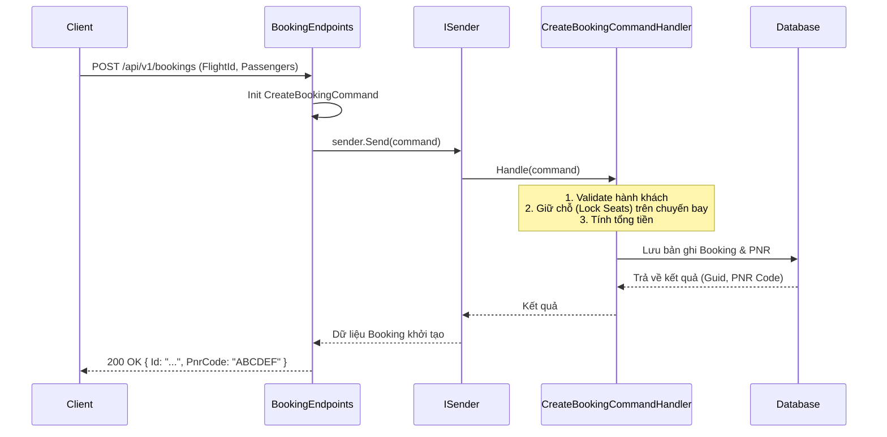

# Luồng hoạt động API hiện tại của Module Bookings

Module `Bookings` trong hệ thống chịu trách nhiệm quản lý quy trình đặt vé, thanh toán và xuất vé điện tử. Tương tự như các module khác, nó sử dụng **Minimal APIs** và giao tiếp thông qua hệ thống CQRS.

## 1. Kiến trúc luồng chung

Luồng đặt vé liên quan mật thiết với module Flights (lấy thông tin chuyến bay) và Users (thông tin người đặt). Do đó, các Endpoint ở module này thường kết nối đến Application Layer nơi xử lý nhiều logic nghiệp vụ phức tạp về thanh toán và xuất vé.

---

## 2. Các Endpoint hiện hành

Các API của module này nằm tại route base là `/api/v1` với OpenAPI tag là `Bookings Module`.

### 2.1. Quản lý Đơn đặt chỗ (Bookings)
- **`POST /api/v1/bookings`**: Tạo mới một đơn đặt chỗ.
  - **Payload (`CreateBookingRequest`)**: ID của chuyến bay (`FlightId`) và danh sách hành khách (`Passengers` - bao gồm Tên, CMND/CCCD, Số ghế).
  - Trả về mã PNR (Passenger Name Record) để tra cứu.
- **`GET /api/v1/bookings/{id}`**: Xem chi tiết đơn đặt chỗ (trạng thái, tổng giá tiền, PNR Code).
- **`GET /api/v1/bookings/my-bookings`** *(RequireAuthorization)*: Lấy danh sách lịch sử các đơn đặt chỗ thuộc về người dùng đang đăng nhập.
- **`DELETE /api/v1/bookings/{id}`**: Hủy một đơn đặt chỗ (ví dụ khi người dùng đổi ý hoặc quá thời hạn thanh toán).

### 2.2. Thanh toán và Vé điện tử (Payments & Tickets)
- **`POST /api/v1/bookings/{id}/pay`**: Thực hiện thanh toán cho đơn đặt chỗ.
  - **Payload (`PayBookingRequest`)**: Phương thức thanh toán (`PaymentMethod`) và Số tiền (`Amount`).
  - Giao tiếp với cổng thanh toán hoặc logic xử lý thanh toán nội bộ.
- **`GET /api/v1/tickets/{id}`**: Tra cứu thông tin vé điện tử (Electronic Ticket) sau khi thanh toán thành công.
  - Trả về thông tin vé cụ thể (TicketId, Tên Hành Khách, Số Ghế).

---

## 3. Ví dụ luồng chi tiết: Quá trình tạo đơn đặt chỗ (Create Booking Flow)

Đây là quy trình nòng cốt của module:

## 4. Ghi chú tích hợp
- Trong thực tế, quá trình giữ chỗ (Lock Seats) cần phải có giao tiếp chéo giữa Module `Bookings` và Module `Flights` thông qua Domain Events hoặc gRPC/REST nội bộ.
- Thanh toán (`/pay`) cũng sẽ sinh ra các sự kiện như `BookingPaidEvent` để hệ thống tự động sinh vé điện tử (Tickets).
