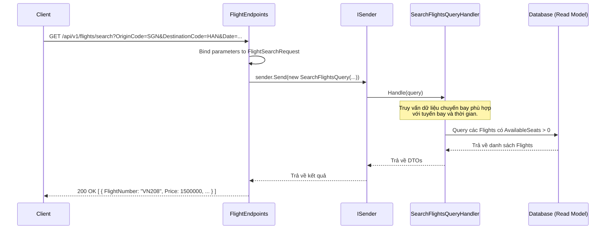

# Luồng hoạt động API hiện tại của Module Flights

Module `Flights` trong hệ thống chịu trách nhiệm quản lý thông tin các chuyến bay, tuyến bay, sân bay và tình trạng ghế trống. Cấu trúc tuân theo **Clean Architecture** và sử dụng **Minimal APIs**.

## 1. Kiến trúc luồng chung

Tương tự như module Users, các API ở đây nhận HTTP request, đóng gói thành các tham số (hoặc Command/Query nếu sử dụng MediatR) và chuyển tiếp tới Application Layer. Dữ liệu trả về được định dạng thành JSON và kèm theo các mã HTTP Status code tương ứng.

---

## 2. Các Endpoint hiện hành

Tất cả các API của module này được nhóm chung dưới route base là `/api/v1` và được đánh tag OpenAPI là `Flights Module`.

### 2.1. Quản lý Sân bay (Airports)
- **`GET /api/v1/airports`**: Lấy danh sách sân bay. Có hỗ trợ tìm kiếm qua tham số chuỗi query (`?search=...`). 
  - *Cho phép truy cập nặc danh để phục vụ tìm kiếm cho người dùng cuối.*
- **`GET /api/v1/airports/{id}`**: Lấy thông tin chi tiết một sân bay cụ thể theo ID.

### 2.2. Quản lý Tuyến bay (Routes)
- **`GET /api/v1/routes`**: Lấy danh sách các tuyến bay hiện có (ví dụ SGN - HAN).

### 2.3. Quản lý Chuyến bay (Flights)
Các endpoint phục vụ chính cho quy trình tìm kiếm và hiển thị chuyến bay của hệ thống:

- **`GET /api/v1/flights/search`**: Tìm kiếm chuyến bay dựa theo yêu cầu.
  - **Tham số (`FlightSearchRequest`)**: Bao gồm mã sân bay đi (`OriginCode`), mã sân bay đến (`DestinationCode`), và Ngày đi (`Date`).
  - *Cho phép nặc danh.*
- **`GET /api/v1/flights/{id}`**: Xem thông tin chi tiết của một chuyến bay cụ thể bằng ID (ví dụ: giờ khởi hành, tình trạng trạng chuyến bay).
- **`GET /api/v1/flights/{id}/seats`**: Lấy sơ đồ ghế và tình trạng đặt chỗ (trống/đã đặt, hạng ghế, giá tiền) của một chuyến bay.
- **`POST /api/v1/flights`** *(RequireAuthorization: "AdminOrStaff")*: Tạo một chuyến bay mới. Chỉ dành cho nhân viên hệ thống hoặc Admin.
  - **Payload (`CreateFlightRequest`)**: Chứa thông tin về Tuyến bay (`RouteId`), Máy bay (`AirplaneId`), Số hiệu chuyến bay, Giá cơ bản (`BasePrice`), Thời gian khởi hành và Hạ cánh dự kiến.

---

## 3. Ví dụ luồng chi tiết: Tìm kiếm chuyến bay (Flight Search Flow)

Luồng tìm kiếm chuyến bay là luồng được gọi nhiều nhất từ phía khách hàng:

