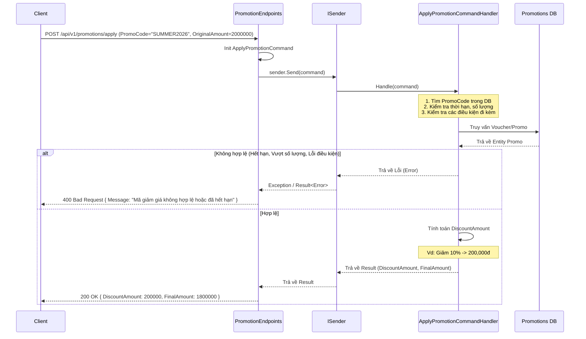

# Luồng hoạt động API dự kiến của Module Promotions (Draft)

Mặc dù Module `Promotions` (Khuyến mãi) hiện tại chưa được triển khai mã nguồn cụ thể, tài liệu này phác thảo cấu trúc và luồng API dự kiến để định hướng cho việc phát triển trong tương lai. Kiến trúc vẫn tuân theo **Clean Architecture**, **CQRS** qua MediatR và **Minimal APIs**.

## 1. Kiến trúc luồng chung

Module Promotions sẽ quản lý các chương trình khuyến mãi, mã giảm giá (Promo Code) và logic tính toán chiết khấu. Nó cần cung cấp Endpoint cho **Khách hàng** (tra cứu và áp dụng mã giảm giá) cũng như **Admin** (tạo mới, chỉnh sửa các chiến dịch khuyến mãi).

---

## 2. Các Endpoint dự kiến

Dự kiến các API của module này sẽ chia làm hai nhóm chính:

### 2.1. Nhóm quản lý Khuyến mãi (Admin)
Được đặt dưới route `/api/v1/admin/promotions` và yêu cầu quyền `AdminOnly`.

- **`POST /`**: Tạo một chương trình khuyến mãi/mã giảm giá mới.
  - **Payload**: Tên chương trình, Mã code (VD: `SUMMER2026`), Loại giảm giá (Phần trăm / Số tiền cố định), Giá trị giảm, Số lượng giới hạn, Thời gian bắt đầu và kết thúc, Các điều kiện áp dụng (chỉ áp dụng cho route cụ thể, hạng vé cụ thể).
- **`PUT /{id}`**: Cập nhật thông tin khuyến mãi.
- **`DELETE /{id}`**: Hủy hoặc vô hiệu hóa một mã khuyến mãi trước thời hạn.
- **`GET /`**: Lấy danh sách tất cả các khuyến mãi (cả đã hết hạn) để quản trị.

### 2.2. Nhóm sử dụng Khuyến mãi (Public / Khách hàng)
Được đặt dưới route `/api/v1/promotions`.

- **`GET /active`**: Lấy danh sách các chương trình khuyến mãi đang diễn ra mà khách hàng có thể sử dụng (để hiển thị trên banner trang chủ).
- **`GET /{code}`**: Lấy chi tiết thông tin và điều kiện của một mã giảm giá cụ thể.
- **`POST /apply`**: Kiểm tra tính hợp lệ và tính toán số tiền giảm giá dựa trên giỏ hàng/chuyến bay.
  - **Payload (`ApplyPromotionRequest`)**: Mã code (`PromoCode`), Mã chuyến bay (`FlightId`), Tổng tiền tạm tính (`OriginalAmount`).
  - **Response**: Trạng thái hợp lệ (Hợp lệ / Hết hạn / Không đủ điều kiện), Số tiền được giảm (`DiscountAmount`), và Tổng tiền sau giảm (`FinalAmount`).

---

## 3. Ví dụ luồng chi tiết: Quá trình Áp dụng mã giảm giá (Apply Promotion Flow)

Quy trình áp dụng mã giảm giá thường diễn ra ngay trước bước thanh toán (Checkout) của module Bookings:

## 4. Ghi chú tích hợp (Integration Notes)

- **Giao tiếp liên module**: Trong bước thanh toán cuối cùng tại `Module Bookings`, hệ thống cần một cơ chế nội bộ (Domain Event hoặc MediatR Cross-module call) để gọi sang `Module Promotions` nhằm **đánh dấu mã giảm giá đã được sử dụng thực sự** (trừ đi 1 trong tổng số lượng). Endpoint `/apply` ở trên chủ yếu đóng vai trò "kiểm tra trước" (preview) cho giao diện người dùng.
