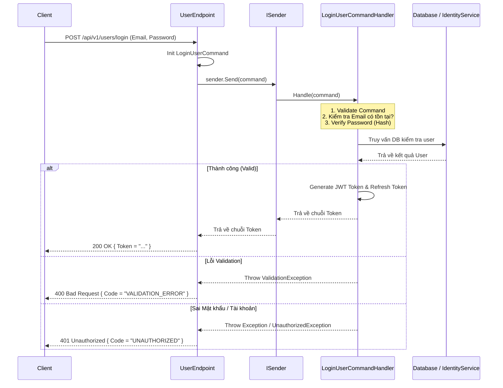

# Luồng hoạt động API hiện tại của Module Users

Module `Users` trong hệ thống tuân theo kiến trúc **Clean Architecture** kết hợp với pattern **CQRS** (Command Query Responsibility Segregation) thông qua thư viện **MediatR**. 

Các endpoint được triển khai dưới dạng **Minimal APIs** (`IEndpoint`). 

Dưới đây là chi tiết về luồng hoạt động của các API thuộc module Users.

## 1. Kiến trúc luồng chung (General Flow)

Mọi request đi vào hệ thống qua các API Users đều tuân theo luồng các bước sau:

1. **HTTP Request** được gửi đến **Minimal API Endpoint** (nằm tại `UserEndpoint.cs`).
2. **Endpoint** thực hiện những việc cơ bản: 
   - Ràng buộc tham số (Binding arguments) từ `[FromBody]`, `[FromServices]`, `ClaimsPrincipal`, etc.
   - Trích xuất thông tin định danh (ví dụ `UserId` từ `ClaimsPrincipal` nếu API yêu cầu xác thực).
3. **Map sang Command/Query**: Khởi tạo một đối tượng `Command` (đối với các thao tác thay đổi dữ liệu: Create, Update, Delete) hoặc `Query` (đối với các thao tác đọc dữ liệu).
4. **Gửi qua MediatR**: Endpoint gọi `await sender.Send(command/query, ct)` để đẩy request vào luồng xử lý của MediatR.
5. **Validation Pipeline (Tùy chọn)**: Nếu có lỗi vi phạm validation, một `ValidationException` được ném ra và catch ngay tại endpoint để trả về `400 Bad Request`.
6. **Handler xử lý (Application Layer)**: Tương ứng với mỗi Command/Query sẽ có một `IRequestHandler` đảm nhận xử lý logic nghiệp vụ, giao tiếp với Database (Infrastructure) hoặc các service bên ngoài (như sinh token).
7. **Trả về HTTP Response**: Kết quả từ Handler được Endpoint hứng và map sang các mã lỗi HTTP tương ứng (như `200 OK`, `204 NoContent`, `401 Unauthorized`, `404 NotFound`...).

---

## 2. Các nhóm API hiện hành

API được chia thành hai nhóm chính (Routing Groups) với các phân quyền (Authorization) khác nhau.

### 2.1. Nhóm Admin (`/api/v1/admin/users`)
*Yêu cầu quyền: `AdminOnly` (Chỉ Admin mới được truy cập)*

- **`GET /`**: Lấy danh sách toàn bộ users.
  - **Query**: `GetUsersQuery`
- **`GET /{id}`**: Lấy thông tin chi tiết một user theo ID.
  - **Query**: `GetUserByIdQuery`
- **`DELETE /{id}`**: Xóa một user theo ID.
  - **Command**: `DeleteUserCommand`
- **`PUT /{id}`**: Cập nhật thông tin và phân quyền (Role) của một user.
  - **Command**: `AdminUpdateUserCommand`
- **`PUT /{id}/reset-password`**: Đặt lại mật khẩu cho user do Admin thực hiện.
  - **Command**: `AdminResetPasswordCommand`

### 2.2. Nhóm User Auth & Profile (`/api/v1/users`)
*Phần lớn cho phép truy cập nặc danh (Anonymous) cho các tính năng xác thực, một số yêu cầu xác thực để truy cập thông tin cá nhân.*

**Xác thực (Authentication):**
- **`POST /register`** *(AllowAnonymous)*: Đăng ký tài khoản mới. Trả về `UserId`.
  - **Command**: `RegisterUserCommand`
- **`POST /login`** *(AllowAnonymous)*: Đăng nhập. Trả về JWT Token.
  - **Command**: `LoginUserCommand`
- **`POST /refresh`** *(AllowAnonymous)*: Làm mới JWT token đã hết hạn thông qua Refresh Token.
  - **Command**: `RefreshTokenCommand`
- **`POST /logout`** *(RequireAuthorization)*: Đăng xuất bằng cách vô hiệu hóa Refresh Token hiện tại.
  - **Command**: `LogoutCommand`
- **`POST /change-password`** *(RequireAuthorization)*: Người dùng tự đổi mật khẩu cá nhân.
  - **Command**: `ChangePasswordCommand`

**Hồ sơ cá nhân (Profile):**
- **`GET /me`** *(RequireAuthorization)*: Lấy thông tin hồ sơ của user đang đăng nhập (dựa trên token).
  - **Query**: `GetUserProfileQuery`
- **`PUT /me`** *(RequireAuthorization)*: Cập nhật thông tin cá nhân (FullName, Phone) của user đang đăng nhập.
  - **Command**: `UpdateUserProfileCommand`

---

## 3. Ví dụ luồng chi tiết: Quá trình Đăng nhập (Login Flow)

Để hiểu rõ hơn, hãy nhìn vào luồng xử lý của quá trình Login:

## 4. Xử lý Exception & Lỗi tại Endpoint

Tất cả các endpoint đều có cơ chế `try...catch` chung để map các Exception từ Application/Domain Layer sang HTTP Response phù hợp:

- `ValidationException` (từ BuildingBlocks): Bắt và trả về `400 Bad Request` kèm theo chi tiết các trường bị lỗi (`Errors`).
- Lỗi logic xác thực (Sai mật khẩu, Token không hợp lệ...): Trả về `401 Unauthorized` kèm Message.
- Lỗi chưa định nghĩa (Exception thường): Trả về `500 Internal Server Error` hoặc `400 Bad Request` tùy theo ngữ cảnh của endpoint.
