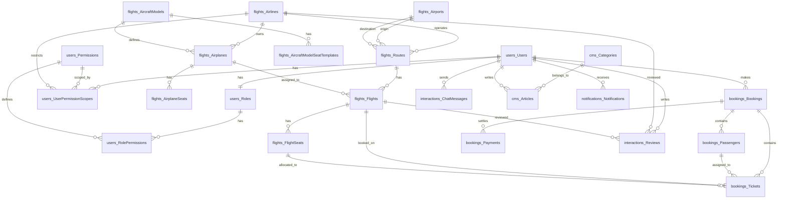

# Airline Ticket Booking System Database Design

This document details the database structure of the system, designed with a Modular Monolith architecture to be ready for separation when scaling.

---

## 1. Entity Relationship Diagram (ERD)

---

## 2. Module Details & Table Structures

### 2.1. Identity Module (`users`)
Manages users and system access control.

#### Table `users.users`
Stores user information (Customer, Partner, Admin).

| Column Name | Data Type | Constraints | Description |
| :--- | :--- | :--- | :--- |
| `Id` | UNIQUEIDENTIFIER | PRIMARY KEY | Unique user identifier |
| `Email` | NVARCHAR(255) | UNIQUE, NOT NULL | Login email address |
| `EmailConfirmed` | BIT | DEFAULT 0, NOT NULL | Email verification status |
| `PasswordHash` | NVARCHAR(MAX) | NOT NULL | Securely hashed password |
| `FullName` | NVARCHAR(255) | NOT NULL | Full name |
| `PhoneNumber` | NVARCHAR(20) | NULL | Contact phone number |
| `Role` | INT | FOREIGN KEY -> Roles(Id), NOT NULL | User role (0: Admin, 1: Staff, 2: Customer) |
| `AvatarUrl` | NVARCHAR(500) | NULL | Avatar image URL |
| `LanguagePreference` | NVARCHAR(10) | DEFAULT 'vi' | Preferred language (vi, en,...) |
| `LastLoginAt` | DATETIME2 | NULL | Last login timestamp |
| `IsActive` | BIT | DEFAULT 1, NOT NULL | Account active status |
| `IsDeleted` | BIT | DEFAULT 0, NOT NULL | Soft delete flag |
| `CreatedAt` | DATETIME2 | DEFAULT GETUTCDATE() | Creation timestamp |
| `UpdatedAt` | DATETIME2 | DEFAULT GETUTCDATE() | Last update timestamp |

#### Table `users.roles`
List of system roles.

| Column Name | Data Type | Constraints | Description |
| :--- | :--- | :--- | :--- |
| `Id` | INT | PRIMARY KEY | Unique role identifier |
| `Name` | NVARCHAR(50) | UNIQUE, NOT NULL | Role name (Admin, Partner, Customer) |
| `Description` | NVARCHAR(255) | NULL | Detailed role description |

#### Table `users.permissions`
Catalog of system functions/permissions.

| Column Name | Data Type | Constraints | Description |
| :--- | :--- | :--- | :--- |
| `Id` | INT | PRIMARY KEY, IDENTITY | Permission identifier |
| `Code` | NVARCHAR(50) | UNIQUE, NOT NULL | Permission code (e.g., 'SELL_TICKET') |
| `Name` | NVARCHAR(100) | NOT NULL | Display name |
| `Description` | NVARCHAR(255) | NULL | Detailed description |

#### Table `users.role_permissions`
Default permissions assigned to each Role.

| Column Name | Data Type | Constraints | Description |
| :--- | :--- | :--- | :--- |
| `RoleId` | INT | FOREIGN KEY -> Roles(Id) | Role link |
| `PermissionId` | INT | FOREIGN KEY -> Permissions(Id) | Permission link |

#### Table `users.user_permission_scopes`
Detailed permissions scoped by Airport or Quota/Limit.

| Column Name | Data Type | Constraints | Description |
| :--- | :--- | :--- | :--- |
| `Id` | UNIQUEIDENTIFIER | PRIMARY KEY | Scope identifier |
| `UserId` | UNIQUEIDENTIFIER | FOREIGN KEY -> Users(Id) | Applies to specific account |
| `PermissionId` | INT | FOREIGN KEY -> Permissions(Id) | Associated action/permission |
| `AirlineId` | UNIQUEIDENTIFIER | NULL, FOREIGN KEY | Scoped by airline |
| `AirportCode` | VARCHAR(10) | NULL | Scoped by airport (e.g., 'SGN') |
| `MaxLimitValue` | INT | NULL | Maximum allowed executions |
| `ScopeDescription` | NVARCHAR(255) | NULL | Scope description |
| `CreatedAt` | DATETIME2 | DEFAULT GETUTCDATE() | Creation timestamp |

---

### 2.2. Flights Module (`flights`)
Manages schedules, airlines, airports, airplanes, and flight seats.

#### Table `flights.airlines`
Manages Airline partners integrated into the system.

| Column Name | Data Type | Constraints | Description |
| :--- | :--- | :--- | :--- |
| `Id` | UNIQUEIDENTIFIER | PRIMARY KEY | Unique airline identifier |
| `IataCode` | NVARCHAR(10) | UNIQUE, NOT NULL | IATA code (e.g., VN, VJ) |
| `Name` | NVARCHAR(255) | NOT NULL | Full airline name |
| `LogoUrl` | NVARCHAR(500) | NULL | Logo image URL |
| `BaseCountry` | NVARCHAR(100) | NULL | Headquarters country |
| `ApiEndpoint` | NVARCHAR(500) | NULL | Partner API endpoint (B2B) |
| `ApiKey` | NVARCHAR(255) | NULL | API key for partner authentication |
| `IsActive` | BIT | DEFAULT 1, NOT NULL | Integration active status |
| `IsDeleted` | BIT | DEFAULT 0, NOT NULL | Soft delete flag |
| `CreatedAt` | DATETIME2 | DEFAULT GETUTCDATE() | Partner creation timestamp |

#### Table `flights.airports`
List of worldwide airports.

| Column Name | Data Type | Constraints | Description |
| :--- | :--- | :--- | :--- |
| `Id` | UNIQUEIDENTIFIER | PRIMARY KEY | Unique airport identifier |
| `IataCode` | NVARCHAR(10) | UNIQUE, NOT NULL | IATA code (e.g., SGN, HAN) |
| `NameEn` | NVARCHAR(255) | NOT NULL | English name |
| `NameVi` | NVARCHAR(255) | NOT NULL | Vietnamese name |
| `CityEn` | NVARCHAR(100) | NOT NULL | English city name |
| `CityVi` | NVARCHAR(100) | NOT NULL | Vietnamese city name |
| `CountryCode` | NVARCHAR(10) | NOT NULL | ISO Alpha-2 country code |
| `Timezone` | NVARCHAR(50) | NOT NULL | Applicable timezone |
| `Latitude` | DECIMAL(9, 6) | NULL | Geographical latitude |
| `Longitude` | DECIMAL(9, 6) | NULL | Geographical longitude |
| `IsActive` | BIT | DEFAULT 1, NOT NULL | Airport active status |
| `IsDeleted` | BIT | DEFAULT 0, NOT NULL | Soft delete flag |

#### Table `flights.aircraft_models`
Catalog of aircraft models (used as templates).

| Column Name | Data Type | Constraints | Description |
| :--- | :--- | :--- | :--- |
| `Id` | UNIQUEIDENTIFIER | PRIMARY KEY | Unique model identifier |
| `Name` | NVARCHAR(100) | NOT NULL | Model name (e.g., Boeing 787-9 Dreamliner) |
| `Manufacturer` | NVARCHAR(100) | NOT NULL | Manufacturer (e.g., Boeing, Airbus) |
| `TotalSeats` | INT | NOT NULL | Total seats per template |
| `IsDeleted` | BIT | DEFAULT 0, NOT NULL | Soft delete flag |

#### Table `flights.aircraft_model_seat_templates`
Seat map templates for each aircraft model.

| Column Name | Data Type | Constraints | Description |
| :--- | :--- | :--- | :--- |
| `Id` | UNIQUEIDENTIFIER | PRIMARY KEY | Unique seat template identifier |
| `AircraftModelId` | UNIQUEIDENTIFIER | FOREIGN KEY -> flights.aircraft_models(id) | Belongs to which model |
| `SeatNumber` | NVARCHAR(10) | NOT NULL | Seat number (e.g., 1A, 12B) |
| `SeatRow` | NVARCHAR(10) | NOT NULL | Seat row (e.g., 1, 12) |
| `SeatColumn` | NVARCHAR(10) | NOT NULL | Seat column (e.g., A, B) |
| `SeatClass` | INT | NOT NULL | Seat class (0: Economy, 1: PremiumEconomy, 2: Business, 3: FirstClass) |
| `IsExtraLegroom` | BIT | DEFAULT 0, NOT NULL | Has extra legroom |
| `PriceMultiplier` | DECIMAL(18, 2) | DEFAULT 1.0, NOT NULL | Price multiplier for this class |

#### Table `flights.airplanes`
Airline fleet infrastructure.

| Column Name | Data Type | Constraints | Description |
| :--- | :--- | :--- | :--- |
| `Id` | UNIQUEIDENTIFIER | PRIMARY KEY | Unique airplane identifier |
| `AirlineId` | UNIQUEIDENTIFIER | FOREIGN KEY -> flights.airlines(id) | Owned by which airline |
| `AircraftModelId` | UNIQUEIDENTIFIER | NULL, FOREIGN KEY -> flights.aircraft_models(id) | Link to model template |
| `Model` | NVARCHAR(100) | NOT NULL | Airplane model (e.g., Boeing 787, Airbus A350) |
| `RegistrationNumber` | NVARCHAR(50) | UNIQUE, NOT NULL | Aircraft registration number |
| `TotalCapacity` | INT | NOT NULL | Total seat capacity |
| `IsDeleted` | BIT | DEFAULT 0, NOT NULL | Soft delete flag |

#### Table `flights.airplane_seats`
Actual seat map of a specific airplane (generated from template).

| Column Name | Data Type | Constraints | Description |
| :--- | :--- | :--- | :--- |
| `Id` | UNIQUEIDENTIFIER | PRIMARY KEY | Unique airplane seat identifier |
| `AirplaneId` | UNIQUEIDENTIFIER | FOREIGN KEY -> flights.airplanes(id) | Belongs to which airplane |
| `SeatNumber` | NVARCHAR(10) | NOT NULL | Seat number (e.g., 1A, 12B) |
| `SeatRow` | NVARCHAR(10) | NOT NULL | Seat row (e.g., 1, 12) |
| `SeatColumn` | NVARCHAR(10) | NOT NULL | Seat column (e.g., A, B) |
| `SeatClass` | INT | NOT NULL | Seat class (0: Economy, 1: PremiumEconomy, 2: Business, 3: FirstClass) |
| `IsExtraLegroom` | BIT | DEFAULT 0, NOT NULL | Has extra legroom |
| `PriceMultiplier` | DECIMAL(18, 2) | DEFAULT 1.0, NOT NULL | Price multiplier for this class |

#### Table `flights.routes`
Flight routes connecting airports.

| Column Name | Data Type | Constraints | Description |
| :--- | :--- | :--- | :--- |
| `Id` | UNIQUEIDENTIFIER | PRIMARY KEY | Route identifier |
| `AirlineId` | UNIQUEIDENTIFIER | FOREIGN KEY -> flights.airlines(id) | Operating airline |
| `OriginAirportId` | UNIQUEIDENTIFIER | FOREIGN KEY -> flights.airports(id) | Origin airport |
| `DestinationAirportId` | UNIQUEIDENTIFIER | FOREIGN KEY -> flights.airports(id) | Destination airport |
| `DistanceKm` | DECIMAL(10, 2) | NULL | Route distance (km) |
| `EstimatedDurationMinutes` | INT | NULL | Estimated flight duration (minutes) |
| `IsDeleted` | BIT | DEFAULT 0, NOT NULL | Soft delete flag |

#### Table `flights.flights`
Detailed actual flight information over time.

| Column Name | Data Type | Constraints | Description |
| :--- | :--- | :--- | :--- |
| `Id` | UNIQUEIDENTIFIER | PRIMARY KEY | Unique flight identifier |
| `RouteId` | UNIQUEIDENTIFIER | FOREIGN KEY -> flights.routes(id) | Detailed route |
| `AirplaneId` | UNIQUEIDENTIFIER | FOREIGN KEY -> flights.airplanes(Id) | Assigned airplane |
| `FlightNumber` | NVARCHAR(20) | NOT NULL | Flight number (e.g., VN213) |
| `DepartureTime` | DATETIME2 | NOT NULL | Scheduled departure time |
| `ArrivalTime` | DATETIME2 | NOT NULL | Scheduled arrival time |
| `BasePrice` | DECIMAL(18, 2) | NOT NULL | Base ticket price |
| `Currency` | NVARCHAR(3) | DEFAULT 'USD' | Applicable currency |
| `Status` | INT | DEFAULT 0, NOT NULL | Status (0: Scheduled, 1: Delayed, 2: Boarding, 3: InAir, 4: Landed, 5: Cancelled) |
| `ExternalId` | NVARCHAR(100) | NULL | External partner sync ID |
| `IsDeleted` | BIT | DEFAULT 0, NOT NULL | Soft delete flag |
| `CreatedAt` | DATETIME2 | DEFAULT GETUTCDATE() | Creation timestamp |
| `UpdatedAt` | DATETIME2 | DEFAULT GETUTCDATE() | Update timestamp |

#### Table `flights.flight_seats`
Manages status and specific seat map of each flight.

| Column Name | Data Type | Constraints | Description |
| :--- | :--- | :--- | :--- |
| `Id` | UNIQUEIDENTIFIER | PRIMARY KEY | Unique flight seat identifier |
| `FlightId` | UNIQUEIDENTIFIER | FOREIGN KEY -> flights.flights(Id) | Belongs to which flight |
| `SeatNumber` | NVARCHAR(10) | NOT NULL | Physical seat number (e.g., 12A, 1A) |
| `SeatClass` | INT | NOT NULL | Seat class (0: Economy, 1: PremiumEconomy, 2: Business, 3: FirstClass) |
| `PriceOverride` | DECIMAL(18, 2) | NULL | Specific seat price override (if any) |
| `IsAvailable` | BIT | DEFAULT 1, NOT NULL | Availability status |
| `IsExtraLegroom` | BIT | DEFAULT 0, NOT NULL | Has extra legroom |

---

### 2.3. Bookings & Tickets Module (`bookings`)
Manages bookings, payments, passenger information, and e-tickets.

#### Table `bookings.bookings`
Customer booking (PNR) information.

| Column Name | Data Type | Constraints | Description |
| :--- | :--- | :--- | :--- |
| `Id` | UNIQUEIDENTIFIER | PRIMARY KEY | Unique booking identifier |
| `UserId` | UNIQUEIDENTIFIER | FOREIGN KEY -> users.users(Id) | User who made the booking |
| `PnrCode` | NVARCHAR(10) | UNIQUE, NOT NULL | International PNR code (e.g., XF89QD) |
| `TotalPrice` | DECIMAL(18, 2) | NOT NULL | Total order amount |
| `Currency` | NVARCHAR(3) | DEFAULT 'USD' | Payment currency |
| `Status` | INT | DEFAULT 0, NOT NULL | Status (0: Pending, 1: Paid, 2: Confirmed, 3: Cancelled, 4: Refunded) |
| `ContactEmail` | NVARCHAR(255) | NOT NULL | Contact email for e-ticket |
| `ContactPhone` | NVARCHAR(20) | NOT NULL | Contact phone number |
| `SpecialRequests` | NVARCHAR(MAX) | NULL | Special requests (meals, wheelchair...) |
| `IsDeleted` | BIT | DEFAULT 0, NOT NULL | Soft delete flag |
| `CreatedAt` | DATETIME2 | DEFAULT GETUTCDATE() | Order creation time |
| `UpdatedAt` | DATETIME2 | DEFAULT GETUTCDATE() | Order status update time |

#### Table `bookings.passengers`
Identity document information for each passenger.

| Column Name | Data Type | Constraints | Description |
| :--- | :--- | :--- | :--- |
| `Id` | UNIQUEIDENTIFIER | PRIMARY KEY | Passenger identifier |
| `BookingId` | UNIQUEIDENTIFIER | FOREIGN KEY -> bookings.bookings(Id) | Belongs to which booking |
| `FirstName` | NVARCHAR(100) | NOT NULL | First and middle name |
| `LastName` | NVARCHAR(100) | NOT NULL | Last name |
| `Gender` | INT | NULL | Gender (0: Male, 1: Female, 2: Other) |
| `DateOfBirth` | DATE | NOT NULL | Date of birth |
| `Nationality` | NVARCHAR(100) | NULL | Nationality |
| `PassportNumber` | NVARCHAR(50) | NOT NULL | Passport/ID number |
| `PassportExpiryDate` | DATE | NOT NULL | Passport expiry date |

#### Table `bookings.tickets`
E-ticket information issued to passengers.

| Column Name | Data Type | Constraints | Description |
| :--- | :--- | :--- | :--- |
| `Id` | UNIQUEIDENTIFIER | PRIMARY KEY | Ticket identifier |
| `BookingId` | UNIQUEIDENTIFIER | FOREIGN KEY -> bookings.bookings(Id) | Link to booking |
| `PassengerId` | UNIQUEIDENTIFIER | FOREIGN KEY -> bookings.passengers(Id) | Ticket owner |
| `FlightId` | UNIQUEIDENTIFIER | FOREIGN KEY -> flights.flights(Id) | Applicable flight |
| `SeatId` | UNIQUEIDENTIFIER | FOREIGN KEY -> flights.flight_seats(Id) | Seat location |
| `TicketNumber` | NVARCHAR(50) | UNIQUE, NOT NULL | Unique E-ticket Number |
| `Gate` | NVARCHAR(20) | NULL | Boarding gate |
| `BoardingTime` | DATETIME2 | NULL | Boarding time |
| `Status` | INT | DEFAULT 0, NOT NULL | Status (0: Valid, 1: CheckedIn, 2: Used, 3: Cancelled) |

#### Table `bookings.payments`
Ticket payment transaction history.

| Column Name | Data Type | Constraints | Description |
| :--- | :--- | :--- | :--- |
| `Id` | UNIQUEIDENTIFIER | PRIMARY KEY | Transaction identifier |
| `BookingId` | UNIQUEIDENTIFIER | FOREIGN KEY -> bookings.bookings(Id) | Payment for which order |
| `TransactionId` | NVARCHAR(100) | UNIQUE, NOT NULL | Transaction ID from third-party gateway |
| `Amount` | DECIMAL(18, 2) | NOT NULL | Actual payment amount |
| `PaymentMethod` | NVARCHAR(50) | NOT NULL | Payment gateway (Stripe, Paypal, VNPay...) |
| `ProviderStatus` | NVARCHAR(50) | NULL | Status returned from gateway |
| `IsSuccessful` | BIT | DEFAULT 0, NOT NULL | Success or failure status |
| `RawResponse` | NVARCHAR(MAX) | NULL | Detailed response (JSON) from payment partner |
| `CreatedAt` | DATETIME2 | DEFAULT GETUTCDATE() | Transaction execution time |

---

### 2.4. Promotions Module (`promotions`)
Manages marketing campaigns and flight ticket discount coupons.

#### Table `promotions.coupons`
Discount code information applied directly to the booking cart.

| Column Name | Data Type | Constraints | Description |
| :--- | :--- | :--- | :--- |
| `Id` | UNIQUEIDENTIFIER | PRIMARY KEY | Coupon identifier |
| `Code` | NVARCHAR(50) | UNIQUE, NOT NULL | Discount code string (e.g., SUMMER2026) |
| `Description` | NVARCHAR(500) | NULL | Program description |
| `DiscountType` | INT | NOT NULL | Discount type (0: Percentage, 1: Fixed Amount) |
| `DiscountValue` | DECIMAL(18, 2) | NOT NULL | Discounted value |
| `MinOrderValue` | DECIMAL(18, 2) | NULL | Minimum booking value to apply |
| `MaxDiscountAmount` | DECIMAL(18, 2) | NULL | Maximum discount amount for % type |
| `StartDate` | DATETIME2 | NOT NULL | Validity start time |
| `EndDate` | DATETIME2 | NOT NULL | Validity end time |
| `UsageLimit` | INT | NULL | Maximum usage limit of the code |
| `UsageCount` | INT | DEFAULT 0 | Actual usage count |
| `IsActive` | BIT | DEFAULT 1 | Coupon active status |
| `IsDeleted` | BIT | DEFAULT 0 | Soft delete flag |

#### Table `promotions.campaigns`
Stores campaign banner advertising information.

| Column Name | Data Type | Constraints | Description |
| :--- | :--- | :--- | :--- |
| `Id` | UNIQUEIDENTIFIER | PRIMARY KEY | Campaign identifier |
| `Title` | NVARCHAR(255) | NOT NULL | Advertising campaign title |
| `BannerUrl` | NVARCHAR(500) | NULL | Campaign ad image |
| `Content` | NVARCHAR(MAX) | NULL | Campaign introduction content |
| `StartDate` | DATETIME2 | NOT NULL | Campaign start time |
| `EndDate` | DATETIME2 | NOT NULL | Campaign end time |
| `IsFeatured` | BIT | DEFAULT 0 | Mark as featured on homepage |
| `IsDeleted` | BIT | DEFAULT 0 | Soft delete flag |

---

### 2.5. Reviews & Feedback Module (`interactions`)
Stores actual reviews from customers after experiencing the service.

#### Table `interactions.reviews`
Service quality reviews for airlines or specific flights.

| Column Name | Data Type | Constraints | Description |
| :--- | :--- | :--- | :--- |
| `Id` | UNIQUEIDENTIFIER | PRIMARY KEY | Review identifier |
| `UserId` | UNIQUEIDENTIFIER | FOREIGN KEY -> users.users(Id) | Reviewer |
| `AirlineId` | UNIQUEIDENTIFIER | FOREIGN KEY -> flights.airlines(Id) | Reviewed airline |
| `FlightId` | UNIQUEIDENTIFIER | FOREIGN KEY -> flights.flights(Id) | Specific reviewed flight |
| `Rating` | INT | CHECK (1-5), NOT NULL | Star rating (from 1 to 5) |
| `Comment` | NVARCHAR(MAX) | NULL | Detailed passenger comment |
| `IsVerifiedPurchase` | BIT | DEFAULT 0 | Status if user actually flew |
| `IsHidden` | BIT | DEFAULT 0 | Admin hid the review (spam, vulgar) |
| `IsDeleted` | BIT | DEFAULT 0 | Soft delete flag |
| `CreatedAt` | DATETIME2 | DEFAULT GETUTCDATE() | Review time |

#### Table `interactions.chat_messages`
Stores chat messages between customers and support staff.

| Column Name | Data Type | Constraints | Description |
| :--- | :--- | :--- | :--- |
| `Id` | UNIQUEIDENTIFIER | PRIMARY KEY | Message identifier |
| `AirlineId` | UNIQUEIDENTIFIER | NOT NULL | Related airline ID |
| `SenderRole` | NVARCHAR(50) | NOT NULL | Sender role (Customer, Staff) |
| `SenderName` | NVARCHAR(255) | NOT NULL | Sender name |
| `CustomerConnectionId` | NVARCHAR(255) | NULL | Customer Connection ID (SignalR) |
| `StaffConnectionId` | NVARCHAR(255) | NULL | Staff Connection ID (SignalR) |
| `Content` | NVARCHAR(MAX) | NOT NULL | Message content |
| `SentAt` | DATETIME2 | NOT NULL | Message sent time |

---

### 2.6. Content CMS Module (`cms`)
Distributes aviation travel articles, guides, and destination blogs.

#### Table `cms.categories`
Article content categories.

| Column Name | Data Type | Constraints | Description |
| :--- | :--- | :--- | :--- |
| `Id` | UNIQUEIDENTIFIER | PRIMARY KEY | Category identifier |
| `Name` | NVARCHAR(100) | NOT NULL | Category name (e.g., Travel Tips, Destinations) |
| `Slug` | NVARCHAR(100) | UNIQUE, NOT NULL | SEO-friendly category URL |
| `IsDeleted` | BIT | DEFAULT 0 | Soft delete flag |

#### Table `cms.articles`
Stores detailed information of articles in the content management page.

| Column Name | Data Type | Constraints | Description |
| :--- | :--- | :--- | :--- |
| `Id` | UNIQUEIDENTIFIER | PRIMARY KEY | Article identifier |
| `CategoryId` | UNIQUEIDENTIFIER | FOREIGN KEY -> cms.categories(Id) | Parent category |
| `AuthorId` | UNIQUEIDENTIFIER | FOREIGN KEY -> users.users(Id) | Article author |
| `Title` | NVARCHAR(255) | NOT NULL | Article title |
| `Slug` | NVARCHAR(255) | UNIQUE, NOT NULL | SEO-friendly article URL |
| `Summary` | NVARCHAR(500) | NULL | Short article summary |
| `Content` | NVARCHAR(MAX) | NOT NULL | Detailed article content in HTML/Markdown |
| `ThumbnailUrl` | NVARCHAR(500) | NULL | Article thumbnail image |
| `PublishedAt` | DATETIME2 | NULL | Publish time to homepage |
| `Status` | INT | DEFAULT 0, NOT NULL | Article status (0: Draft, 1: Approved, 2: Archived) |
| `ViewCount` | INT | DEFAULT 0 | Total article views |
| `IsDeleted` | BIT | DEFAULT 0 | Soft delete flag |
| `CreatedAt` | DATETIME2 | DEFAULT GETUTCDATE() | Article creation time |

---

### 2.7. System Logs Module (`logs`)
Records system activity logs.

#### Table `logs.system_logs`
Stores system logs and runtime errors.

| Column Name | Data Type | Constraints | Description |
| :--- | :--- | :--- | :--- |
| `Id` | UNIQUEIDENTIFIER | PRIMARY KEY | Log identifier |
| `Level` | NVARCHAR(50) | NOT NULL | Log level (Info, Warning, Error, Critical) |
| `Message` | NVARCHAR(MAX) | NOT NULL | Log content |
| `Source` | NVARCHAR(255) | NULL | Log source (Application, Module...) |
| `Exception` | NVARCHAR(MAX) | NULL | Exception details |
| `UserId` | UNIQUEIDENTIFIER | NULL | Executing user ID (if any) |
| `AirlineId` | UNIQUEIDENTIFIER | NULL | Related airline ID (if any) |
| `IpAddress` | NVARCHAR(50) | NULL | IP address |
| `CreatedAt` | DATETIME2 | DEFAULT GETUTCDATE() | Log recording time |

---

### 2.8. Notifications Module (`notifications`)
Manages notification templates and delivery queues (Email, SMS, Push, SignalR).

#### Table `notifications.notification_templates`
Stores available notification templates for each event type.

| Column Name | Data Type | Constraints | Description |
| :--- | :--- | :--- | :--- |
| `Id` | UNIQUEIDENTIFIER | PRIMARY KEY | Template identifier |
| `Code` | NVARCHAR(100) | UNIQUE, NOT NULL | Template code (e.g., 'BOOKING_CONFIRMED', 'FLIGHT_DELAYED') |
| `Subject` | NVARCHAR(255) | NOT NULL | Notification subject |
| `BodyTemplate` | NVARCHAR(MAX) | NOT NULL | Template content (supports placeholders) |
| `Language` | NVARCHAR(10) | DEFAULT 'vi' | Template language |
| `CreatedAt` | DATETIME2 | DEFAULT GETUTCDATE() | Creation time |

#### Table `notifications.notifications`
Stores sent or pending notifications to users.

| Column Name | Data Type | Constraints | Description |
| :--- | :--- | :--- | :--- |
| `Id` | UNIQUEIDENTIFIER | PRIMARY KEY | Notification identifier |
| `UserId` | UNIQUEIDENTIFIER | NULL, FK -> users.users(Id) | Recipient (if has account) |
| `Recipient` | NVARCHAR(255) | NOT NULL | Email or phone number |
| `Subject` | NVARCHAR(255) | NULL | Subject |
| `Content` | NVARCHAR(MAX) | NOT NULL | Notification content |
| `Type` | INT | NOT NULL | Type: 0: Email, 1: SMS, 2: Push, 3: SignalR |
| `Status` | INT | DEFAULT 0 | Status: 0: Pending, 1: Sent, 2: Failed |
| `RetryCount` | INT | DEFAULT 0 | Retry attempts |
| `ErrorMessage` | NVARCHAR(MAX) | NULL | Error message (if failed) |
| `SentAt` | DATETIME2 | NULL | Successful send time |
| `CreatedAt` | DATETIME2 | DEFAULT GETUTCDATE() | Creation time |

---

## 3. Performance Indexes

Indexes are created to optimize query speed for tables with high transaction volumes.

| Index Name | Table | Column | Purpose |
| :--- | :--- | :--- | :--- |
| `IX_Flights_Departure` | flights.flights | DepartureTime | Lookup flights by departure time |
| `IX_Flights_Route` | flights.flights | RouteId | Filter flights by route |
| `IX_Bookings_Pnr` | bookings.bookings | PnrCode | Lookup booking by PNR code |
| `IX_Bookings_User` | bookings.bookings | UserId | List bookings by user |
| `IX_Tickets_Number` | bookings.tickets | TicketNumber | Lookup ticket by e-ticket number |
| `IX_Notifications_User` | notifications.notifications | UserId | Get user's notification list |

## 4. Soft Delete

The system applies the Soft Delete pattern via SQL Server INSTEAD OF DELETE triggers. When executing a DELETE command, the trigger automatically converts it to an UPDATE `IsDeleted = 1` instead of physical deletion.

Applied tables:

| Schema | Tables |
| :--- | :--- |
| users | users, roles, permissions, role_permissions, user_permission_scopes |
| flights | airlines, airports, aircraft_models, aircraft_model_seat_templates, airplanes, airplane_seats, routes, flights, flight_seats |
| bookings | bookings, passengers, tickets, payments |
| promotions | coupons, campaigns |
| interactions | reviews, chat_messages |
| cms | categories, articles |
| logs | system_logs |
| notifications | notification_templates, notifications |

Benefits of Soft Delete:
- Retains historical data for audit and reporting purposes.
- Avoids foreign key (FK) violation errors when child data is being referenced.
- Easy to restore data when necessary.
