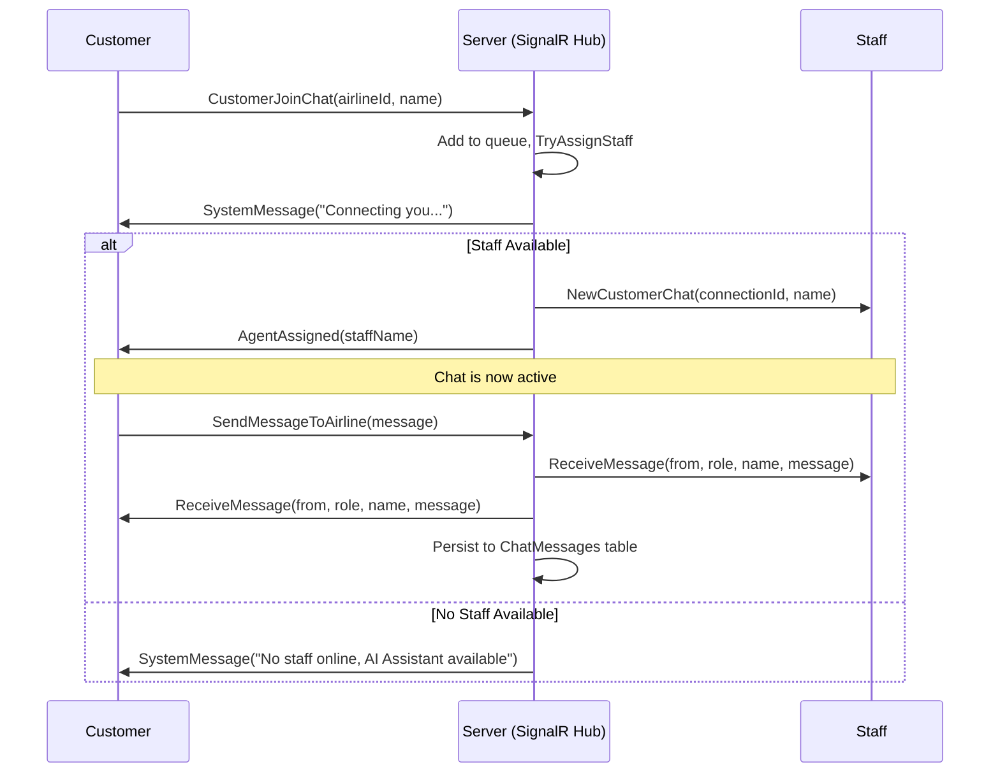

# Support Chat Module

## Overview
The **Support Chat Module** provides real-time customer support via SignalR WebSockets. Customers connect to an airline's support queue, are automatically assigned to an available staff member using load balancing (fewest active chats), and can exchange messages in real time. All conversations are persisted to the database for auditing and history.

---

## How It Works (For End Users & Clients)

### Customer Journey
1. **Open Chat**: A customer navigates to the support page and clicks "Start Chat".
2. **Enter Queue**: The system calls `CustomerJoinChat` with the airline's ID and the customer's name.
3. **Staff Assignment**: The system automatically selects the best available staff member using load balancing (fewest active chats) and assigns them to the customer.
4. **Chat**: The customer sends messages via `SendMessageToAirline`. Messages are delivered instantly to the assigned staff member and simultaneously persisted to the database.
5. **Disconnect**: When the customer closes the page or loses connection, the staff member is notified. If no staff are available, the customer receives a system notification prompting them to try again later or consult the AI Travel Assistant.

### Staff Journey
1. **Go Online**: A staff member calls `StaffRegister` with their airline's ID. They are now available for assignment.
2. **Receive Customers**: When a customer joins and is assigned, the staff receives a `NewCustomerChat` event with the customer's name and connection ID.
3. **Reply**: The staff sends messages via `SendMessageToCustomer` targeting the customer's connection ID.
4. **Multi-Customer Support**: A staff member can handle multiple customer connections simultaneously.
5. **Reconnection Handling**: If a staff member disconnects, their assigned customers are automatically queued for reassignment to other online staff members.

---

## Real-Time Communication Flow

---

## Domain Entities & Data Model

### ChatMessage
A single persisted chat message in the database.
- `Id` (Guid): Unique identifier.
- `AirlineId` (Guid): The airline context for the chat.
- `SenderRole` (string): `"Customer"` or `"Staff"`.
- `SenderName` (string): Display name of the sender.
- `CustomerConnectionId` (string?): SignalR connection ID of the customer.
- `StaffConnectionId` (string?): SignalR connection ID of the staff.
- `Content` (string): The message text.
- `SentAt` (DateTime): UTC timestamp of when the message was sent.

### In-Memory Session Objects
These exist in memory on the server to manage active connection dispatching:

**CustomerChatSession**:
- `ConnectionId` (string): SignalR connection identifier.
- `AirlineId` (Guid): The airline being contacted.
- `CustomerName` (string): Display name.
- `AssignedStaffConnectionId` (string?): Assigned staff's connection ID, or null if waiting.

**StaffSession**:
- `ConnectionId` (string): SignalR connection identifier.
- `AirlineId` (Guid): The airline they support.
- `StaffName` (string): Display name.
- `ActiveCustomerConnectionIds` (HashSet\<string\>): Set of customer connection IDs currently being handled.

---

## SignalR Hub Reference

### Hub Endpoint
- **URL**: `/hubs/support`
- **Authentication**: Optional for initial connection (tokens supported via query string `?access_token=...`)

### Client → Server Methods
| Method | Parameters | Caller | Description |
|--------|------------|--------|-------------|
| `CustomerJoinChat` | `Guid airlineId, string customerName` | Customer | Joins the chat queue for a specific airline. |
| `StaffRegister` | `Guid airlineId, string staffName` | Staff | Registers the staff member as online and ready for assignments. |
| `SendMessageToAirline` | `string message` | Customer | Sends a message to the assigned staff member. |
| `SendMessageToCustomer` | `string customerConnectionId, string message` | Staff | Sends a reply message to a specific customer. |

### Server → Client Events
| Event | Parameters | Recipient | Description |
|-------|------------|-----------|-------------|
| `SystemMessage` | `string message` | Caller | Informational or status notice. |
| `AgentAssigned` | `string staffName` | Customer | Notifies customer that an agent has taken the conversation. |
| `NewCustomerChat` | `string connectionId, string customerName` | Staff | Alerts staff to an assigned customer. |
| `ReceiveMessage` | `string fromId, string role, string name, string message` | Both | Delivers chat messages between customer and staff. |
| `CustomerDisconnected` | `string connectionId, string customerName` | Staff | Notifies staff that the customer has left or disconnected. |
