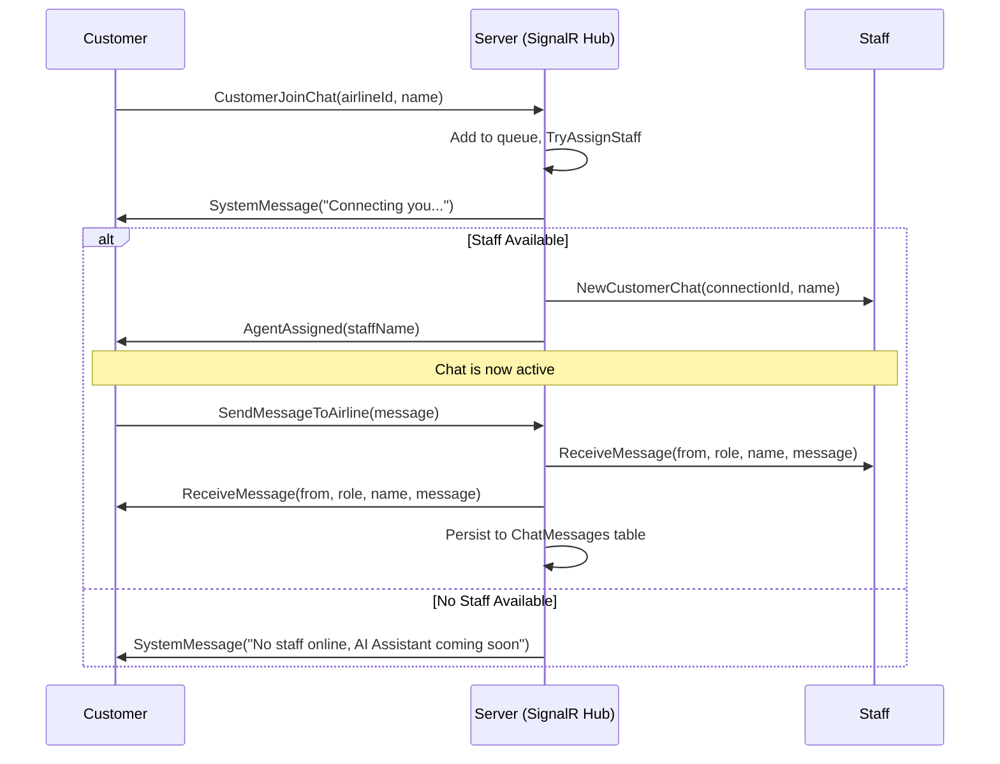

# Support Chat Module

## Overview
The **Support Chat Module** provides real-time customer support via SignalR WebSockets. Customers connect to an airline's support queue, are automatically assigned to an available staff member, and can exchange messages in real time. All conversations are persisted to the database for auditing and history.

---

## How It Works (For End Users & Clients)

### Customer Journey
1. **Open Chat**: A customer navigates to the support page and clicks "Start Chat".
2. **Enter Queue**: The system calls `CustomerJoinChat` with the airline's ID and the customer's name. The customer is placed in a waiting queue.
3. **Staff Assignment**: The system automatically selects the best available staff member using load balancing (fewest active chats) and assigns them to the customer.
4. **Chat**: The customer sends messages via `SendMessageToAirline`. Messages are delivered instantly to the assigned staff member and simultaneously persisted to the database.
5. **Disconnect**: When the customer closes the page or loses connection, the staff member is notified. If no staff are available, the customer sees a system message prompting them to try again later.

### Staff Journey
1. **Go Online**: A staff member calls `StaffRegister` with their airline's ID. They are now available for assignment.
2. **Receive Customers**: When a customer joins and is assigned, the staff receives a `NewCustomerChat` event with the customer's name and connection ID.
3. **Reply**: The staff sends messages via `SendMessageToCustomer` targeting the customer's connection ID.
4. **Multi-Customer Support**: A staff member can handle multiple customers simultaneously. The system tracks all active chat sessions per staff.
5. **Reconnection Handling**: If a staff member disconnects, their assigned customers are automatically reassigned to other available staff. Affected customers receive a system message about the disconnection.

---

## Real-Time Communication Flow



---

## Load Balancing & Auto-Assignment

The system uses a **fewest-active-chats** strategy:
1. Filter all online staff whose `AirlineId` matches the customer's airline.
2. Select the staff member with the fewest active customer connections.
3. Assign the customer to that staff member.
4. Notify both parties.

If no staff are available at the time of assignment, the customer is placed in a waiting state. When a staff member later calls `StaffRegister`, the system checks for waiting customers and assigns them automatically.

---

## Domain Entities & Data Model

### ChatMessage
A single persisted chat message in the database.
- `Id` (Guid): Unique identifier.
- `AirlineId` (Guid): The airline this message belongs to.
- `SenderRole` (string): `"Customer"` or `"Staff"`. Max 20 characters.
- `SenderName` (string): Display name of the sender. Max 100 characters.
- `CustomerConnectionId` (string?): SignalR connection ID of the customer. Max 100 characters. Nullable.
- `StaffConnectionId` (string?): SignalR connection ID of the staff. Max 100 characters. Nullable.
- `Content` (string): The message text.
- `SentAt` (DateTime): UTC timestamp of when the message was sent.

### In-Memory Session Objects
These exist only while the server is running and are not persisted to the database.

**CustomerChatSession** — Tracks a customer's active chat state:
- `ConnectionId` (string): SignalR connection identifier.
- `AirlineId` (Guid): The airline being contacted.
- `CustomerName` (string): Display name.
- `AssignedStaffConnectionId` (string?): Assigned staff's connection ID, or `null` if waiting.

**StaffSession** — Tracks a staff member's online state:
- `ConnectionId` (string): SignalR connection identifier.
- `AirlineId` (Guid): The airline they support.
- `StaffName` (string): Display name.
- `ActiveCustomerConnectionIds` (HashSet\<string\>): Set of customer connection IDs currently being handled.

---

## SignalR Hub Reference

### Hub Endpoint
- **URL**: `/hubs/support`
- **Authentication**: Not required for initial connection. Authentication should be enforced via JWT in production.

### Client → Server Methods

| Method | Parameters | Description |
|--------|------------|-------------|
| `CustomerJoinChat` | `airlineId: Guid`, `customerName: string` | Customer enters the support queue for a specific airline. If no name is provided, defaults to "Guest". |
| `StaffRegister` | `airlineId: Guid`, `staffName: string` | Staff member goes online for their airline. If no name is provided, defaults to "Support Staff". |
| `SendMessageToAirline` | `message: string` | Customer sends a message to their assigned staff. If unassigned, triggers re-assignment. |
| `SendMessageToCustomer` | `customerConnectionId: string`, `message: string` | Staff sends a message to a specific customer by their connection ID. |

### Server → Client Events

| Event | Parameters | Description |
|-------|------------|-------------|
| `SystemMessage` | `message: string` | General system notification (welcome, errors, staff disconnect notices). |
| `AgentAssigned` | `staffName: string` | Notifies the customer that a staff member has been assigned. |
| `ReceiveMessage` | `senderConnectionId: string`, `senderRole: string`, `senderName: string`, `message: string` | Delivers an incoming chat message to the recipient. |
| `NewCustomerChat` | `customerConnectionId: string`, `customerName: string` | Notifies a staff member that a new customer has been assigned to them. |
| `CustomerDisconnected` | `customerConnectionId: string`, `customerName: string` | Notifies a staff member that a customer has disconnected. |

### Disconnection Handling (`OnDisconnectedAsync`)
- **Customer disconnects**: Removes from active sessions. Staff receives `CustomerDisconnected` event.
- **Staff disconnects**: All assigned customers receive a system message ("Support staff has disconnected"). Customers are automatically reassigned to another available staff member, or re-enter the queue if none are available.

---

## Database Schema

### Table: `ChatMessages`
```sql
CREATE TABLE [dbo].[ChatMessages] (
    [Id] UNIQUEIDENTIFIER NOT NULL PRIMARY KEY DEFAULT NEWID(),
    [AirlineId] UNIQUEIDENTIFIER NOT NULL,
    [SenderRole] NVARCHAR(20) NOT NULL,
    [SenderName] NVARCHAR(100) NOT NULL,
    [CustomerConnectionId] NVARCHAR(100) NULL,
    [StaffConnectionId] NVARCHAR(100) NULL,
    [Content] NVARCHAR(MAX) NOT NULL,
    [SentAt] DATETIME2 NOT NULL DEFAULT GETUTCDATE()
);

-- Index for efficient querying of chat history per airline
CREATE INDEX [IX_ChatMessages_AirlineId_SentAt] ON [dbo].[ChatMessages] ([AirlineId], [SentAt]);
```

---

## API Reference
There are no HTTP REST endpoints for this module. All interaction is handled exclusively through the SignalR WebSocket hub at `/hubs/support`.

---

## Future Considerations
- **Authentication**: Currently open for prototyping. Production deployments should enforce JWT authentication for both customers and staff.
- **Chatbot Integration**: A background service (`ChatbotTimeoutHandler`) is stubbed for future AI chatbot support when no staff are available.
- **Persistent Reconnection**: SignalR connection IDs are transient. If a customer refreshes the page, they will need to rejoin the chat as a new session.
